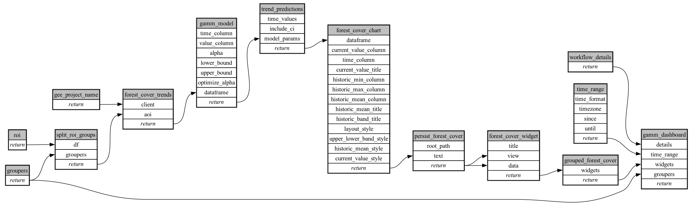

```
# AUTOGENERATED BY ECOSCOPE-WORKFLOWS; see fingerprint in README.md for details

```

```yaml
# fingerprint:
artifacts_sha256_basic: 508e6a5b27ee5bbb518dad3b3c7183d588c8c54d35677e641af5486482597bfd
artifacts_sha256_strict: 40d904d66d541f8c0f445208bdb3f03ca30c46a3c614f55fe3ea35ae60a131e1
installed_requirements:
- channel: https://repo.prefix.dev/ecoscope-workflows/
  name: ecoscope-workflows-core
  version: {version: ==0.22.16}
- channel: https://repo.prefix.dev/ecoscope-workflows/
  name: ecoscope-workflows-ext-ecoscope
  version: {version: ==0.22.16}
- channel: https://repo.prefix.dev/ecoscope-workflows-custom/
  name: ecoscope-workflows-ext-custom
  version: {version: ==0.0.37}
- channel: https://repo.prefix.dev/ecoscope-workflows-custom/
  name: ecoscope-workflows-ext-gamm-trend-analysis
  version: {version: ==0.0.0}
params_sha256: d32079183233f7812f7351584a0960e9b78a0d753a2dd427700d6b85174c5566
spec_sha256: f2342b990eb13b0a73d21cd6d4738d246ca6e32826f91388c0e6ac144654b625

```

# ecoscope-workflows-hansen-deforestation-workflow


