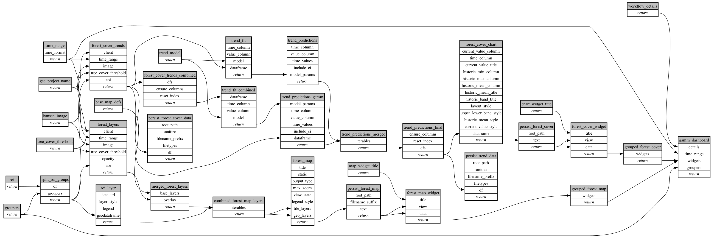

```
# AUTOGENERATED BY ECOSCOPE-WORKFLOWS; see fingerprint in README.md for details

```

```yaml
# fingerprint:
artifacts_sha256_basic: 326be7442deb885010512d8508071c8f37ac62b8fb5f73c12322bd339d7edaa6
artifacts_sha256_strict: 89736da9bade608329356d1bbeacd62ec9a02b70200dfdb41e53c36f8008ebce
installed_requirements:
- channel: https://repo.prefix.dev/ecoscope-workflows/
  name: ecoscope-platform
  version: {version: ==2.23.0}
- channel: conda-forge
  name: pydeck
  version: {version: ==0.9.2}
- channel: conda-forge
  name: arviz
  version: {version: ==1.3.0}
- channel: conda-forge
  name: arviz-plots
  version: {version: ==1.3.1}
- channel: conda-forge
  name: bambi
  version: {version: ==0.20.0}
- channel: conda-forge
  name: pymc
  version: {version: ==6.3.1}
params_sha256: 66e8b18818d5ed801b8381b450d869d109777ce445b062aa6f6bea4ac3f99468
spec_sha256: ce2827a94ca7b485030d86d3bcbde0688bf2cbe8c078791521ef8d17f6d9fe22

```

# ecoscope-workflows-hansen-deforestation-workflow


