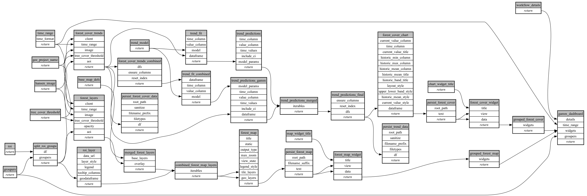

```
# AUTOGENERATED BY ECOSCOPE-WORKFLOWS; see fingerprint in README.md for details

```

```yaml
# fingerprint:
artifacts_sha256_basic: b497c5bf3297bd8b5bca49d5bac62ee468c93c1ac6242b4ff33521fd7c708f8e
artifacts_sha256_strict: 0e316dbce27137746487fba95cb7d7502b0ed54ff51459d83f72b2035d29fbc4
installed_requirements:
- channel: https://repo.prefix.dev/ecoscope-workflows/
  name: ecoscope-platform
  version: {version: ==2.25.1}
- channel: conda-forge
  name: pydeck
  version: {version: ==0.9.2}
- channel: conda-forge
  name: arviz
  version: {version: ==1.3.0}
- channel: conda-forge
  name: arviz-plots
  version: {version: ==1.3.2}
- channel: conda-forge
  name: bambi
  version: {version: ==0.21.0}
- channel: conda-forge
  name: pymc
  version: {version: ==6.3.1}
params_sha256: 559b9d74debabfdb31511911ad6cdef9d1f6c112684cb475732342930661ea03
spec_sha256: ad6018965b39aa95170dec4077bdc95c546bd715a7dc08c5aaae8541cd6ab0c6

```

# ecoscope-workflows-hansen-deforestation-workflow


